# ORFanID Operating Instructions

ORFanID Sequence Submission
-------------
Visit the ORFanGenes website (http://orfangenes.com/) and click Get Started on the landing page.

An ORFan analysis can be done by providing either  a DNA or protein sequence and the scientific name (or ID) of the organism. 

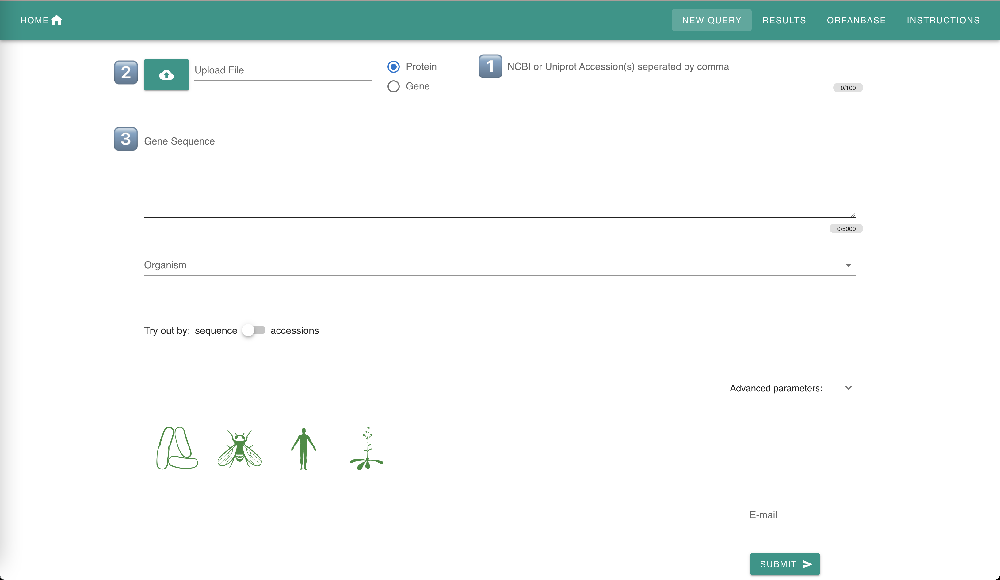

The input DNA or protein sequences can be added in three ways: Search by Accession, FASTA File Upload, or Direct Input. Details on the Input sequences are below:

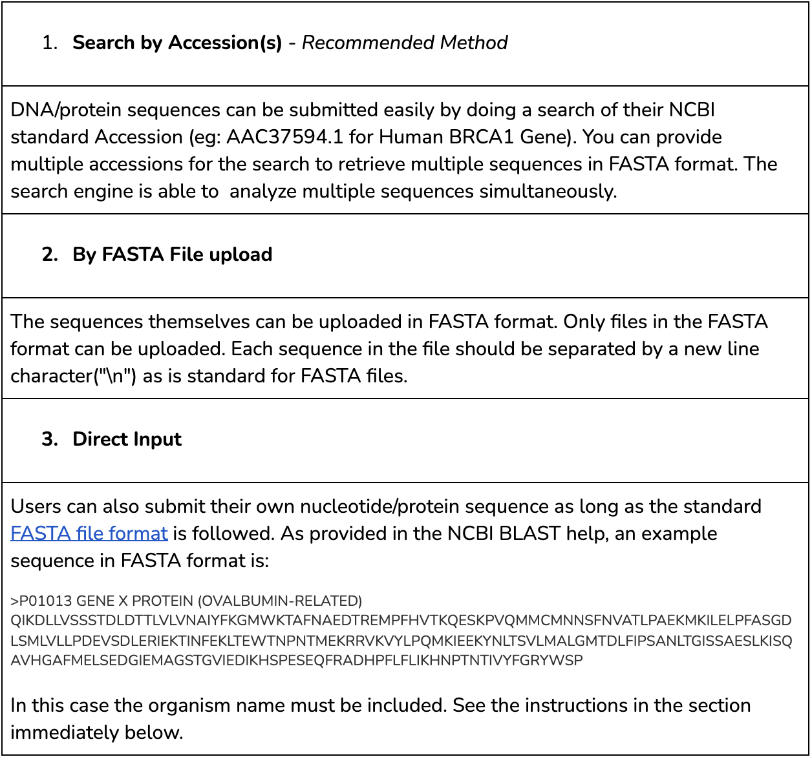

Next, the Organism Name of the input gene must be specified. The Organism can be specified using the auto-completion selection textbox (see the screenshot below). Start typing and auto-completion will help you select the organism quickly by showing the Scientific name, NCBI Taxonomy ID and an image. If the organism of interest is not in the ORFanID database, please go to NCBI Taxonomy Database and obtain the full scientific name and the taxonomy ID which has to be added within parentheses. Example Organism names are provided in the screenshot below.

NOTE: The search engine will take UP TO 5,000 characters for a query on the Gene Sequence. Please DO NOT input more than 5,000 characters as your query will not be processed. 

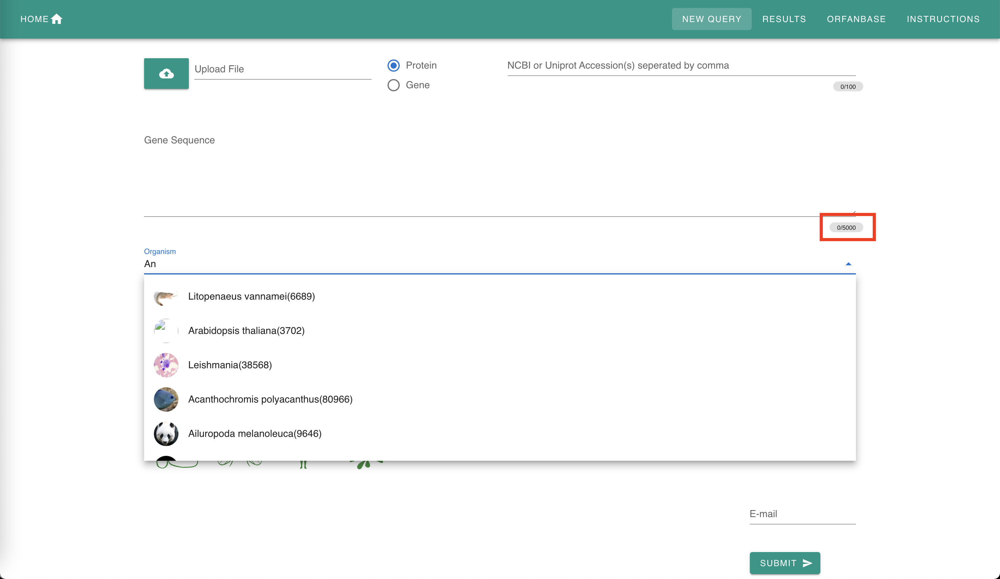

Example sequences are provided to demonstrate the use of this ORFan identifying software engine. When a graphical icon at the bottom left of the screen is selected, the appropriate data will be automatically loaded into the forms. The “sequence” or the “accession” option can be selected.

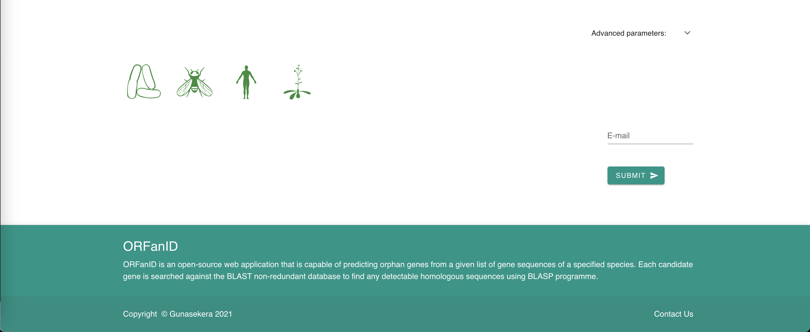

The search can be fine tuned using optional parameters by clicking on the "Advance Parameter" link. The following parameters can be adjusted according to the user preference:

&nbsp;&nbsp;&nbsp;&nbsp;&nbsp;&nbsp;1. Maximum eValue for BLAST(e-10)  
&nbsp;&nbsp;&nbsp;&nbsp;&nbsp;&nbsp;2. Maximum number of target sequences for BLAST results  
&nbsp;&nbsp;&nbsp;&nbsp;&nbsp;&nbsp;3. Identity 
An example is provided below. In each case, the slider should be moved to set the appropriate value.

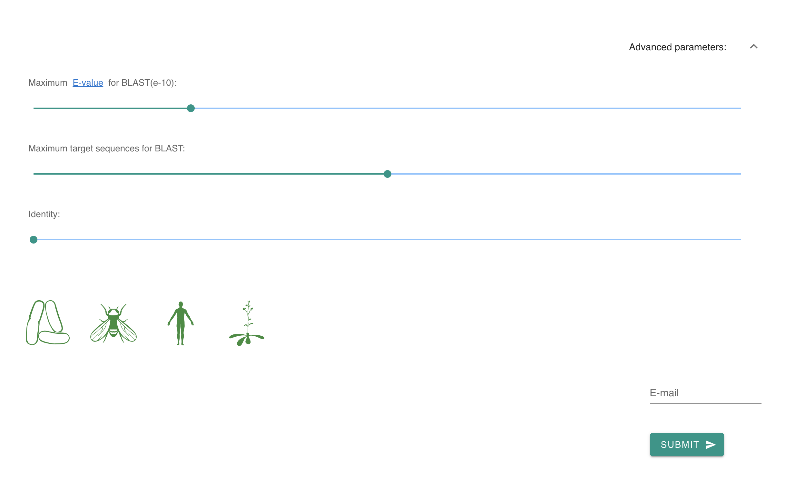

When either the gene sequence, or accession number, and the organism has been determined, click "submit" to start the ORFanID search. 

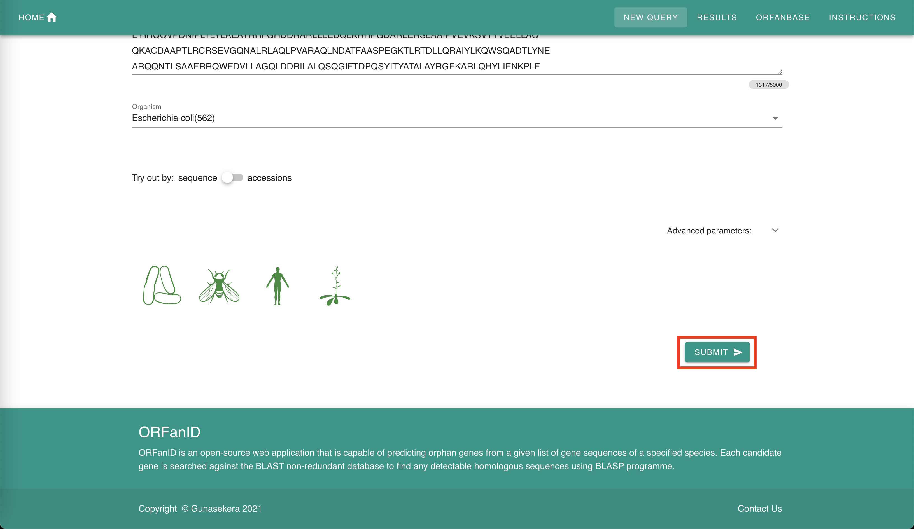

If you would like to double check–or modify–your search request, simply click on "cancel" to cancel the ORFanID search. Otherwise, click on "Submit" to start the ORFanID search. 

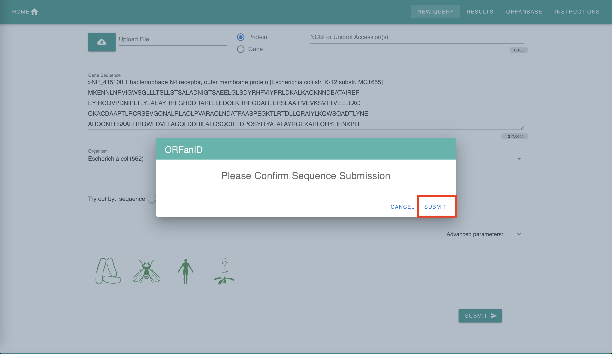

Next, click "Ok".

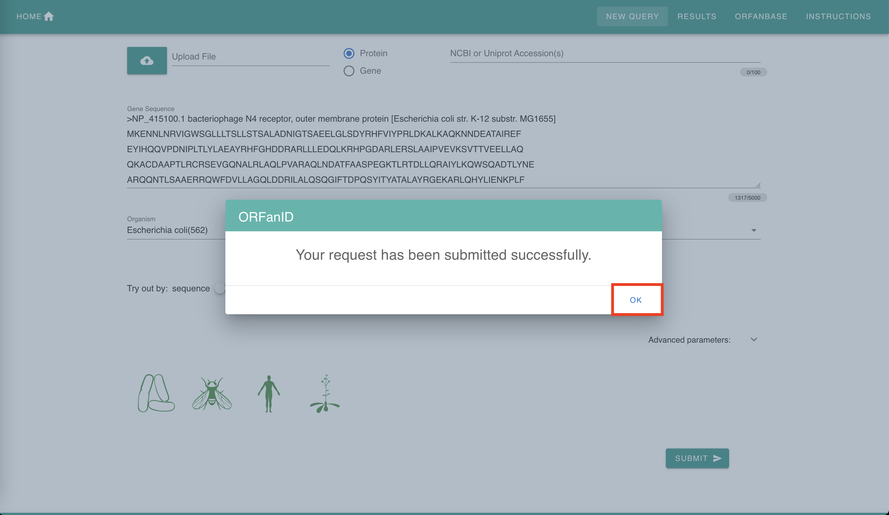

Upon clicking "Ok", you will be redirected to this status page. ORFanID will process the input sequence and depending on the query, as well as the workload of the ORFanID servers, you should expect a result within 5 minutes. 

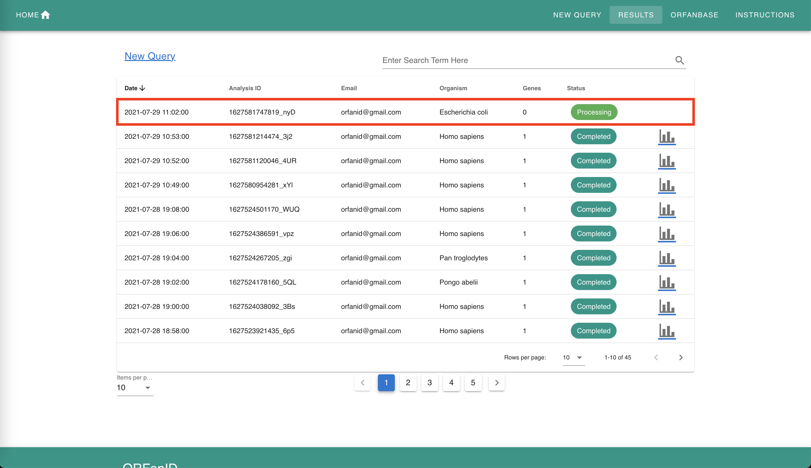

Interpreting Results
-------------
To view the results of the ORFanID search, click on the "bar graph" button. 

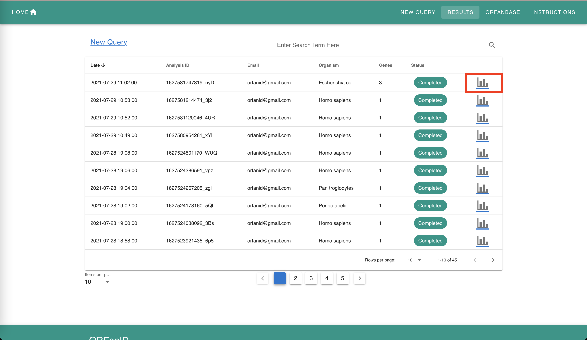

Results will be displayed as in the screenshot below:

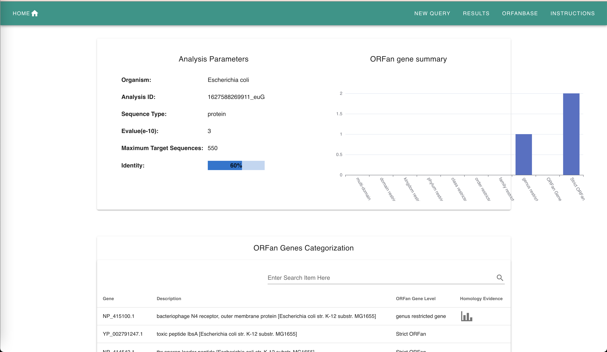

The example shown above contains three genes. One of the sequences are Genus Restricted Genes, and the second and thrid are ORFan Genes. The BLAST Results table shows the taxonomies (and their parents) for each gene in the input sequence from the BLAST search.  

A graphical representation of the taxonomy tree can be viewed by selecting the "graph" button for each sequence that is not an ORFan Gene. 

  

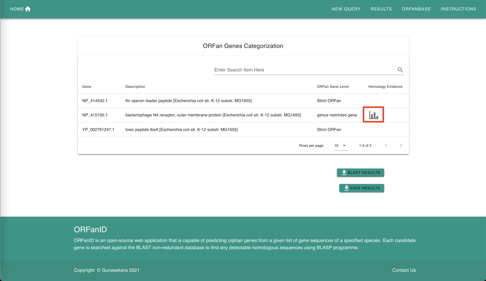

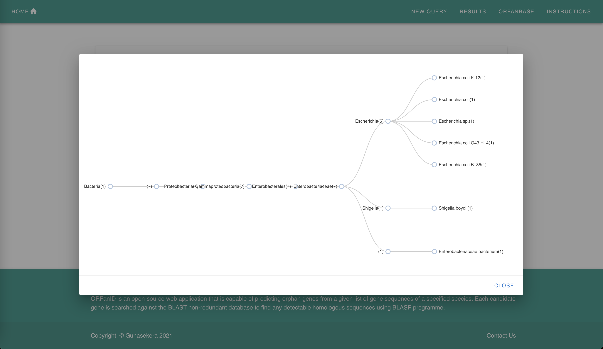

Results can be submitted to the “ORFanBase” database by providing the user contact information as follows:

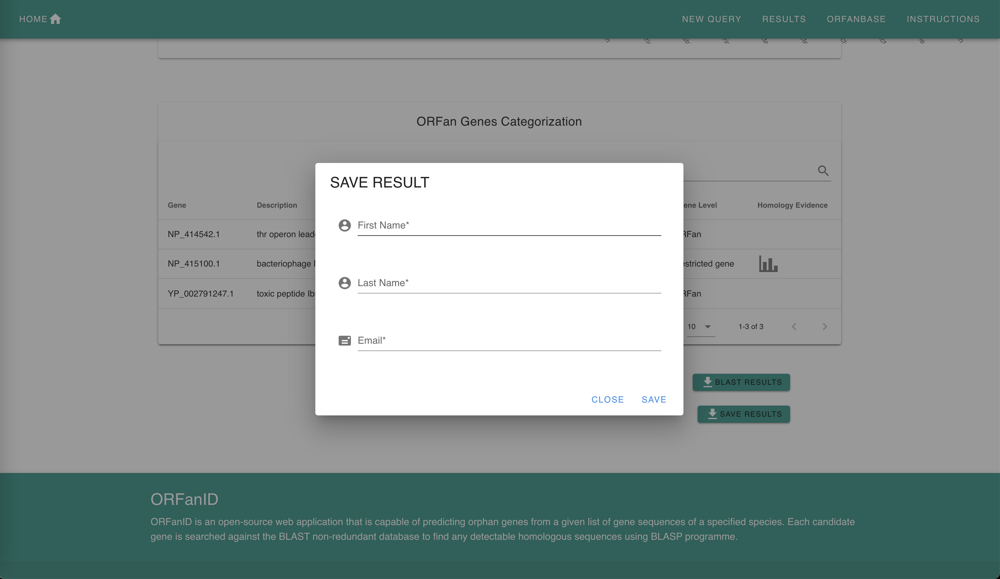 

The Results page displays previous ORFanID analyses stored in the database.

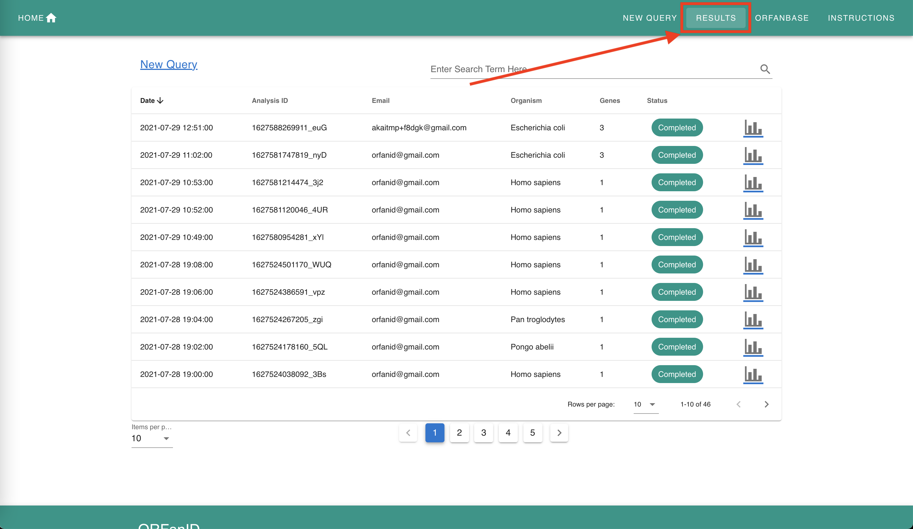    

The ORFanBase Database
-------------
Genes that have been categorized from the analysis and submitted to the “ORFanbase” database can be found on the “ORFanbase” page:

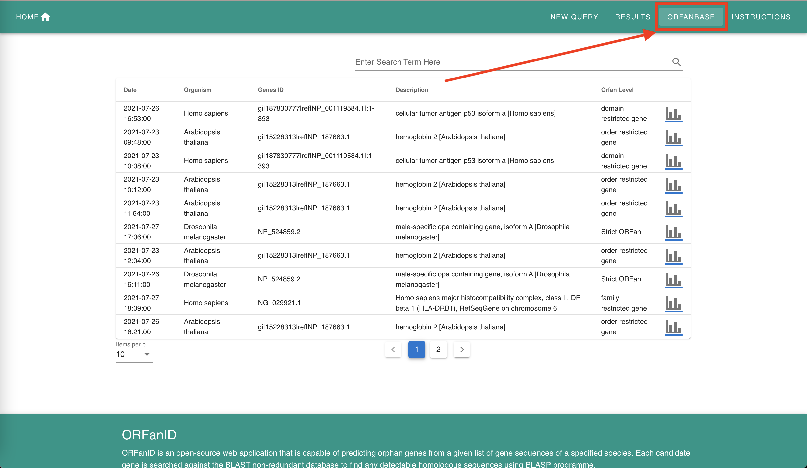 

The orphan gene information obtained can now be used for your research purposes.  

 If you have any questions regarding the instructions for using the ORFanID to search and find ORFan Genes of interest to you, or regarding the analysis of your data input, please email us at:  info@orfangenes.com

